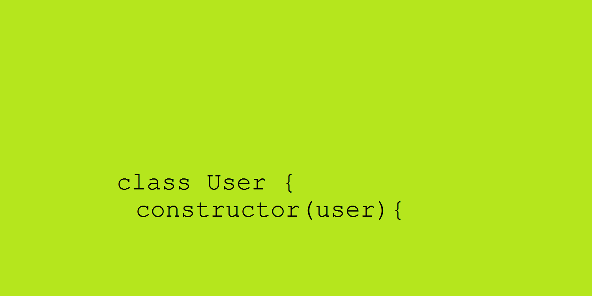

# About Classes in Node.js

Preface. This is my first article and English is not my native language. At the beginning, I wrote it for myself, just for memory, but now I decided to share it. Maybe it could be useful for someone. So, don’t judge me too strictly.

Classes is the most important fundamental concept in Object Oriented development. Therefore, it is important to know how to work with them. ES6 gives us very nice new syntax for class declaration.
```JavaScript
class Class1{
	constructor(arg){
		console.log('Initialize Class1 object');
		console.log('Arg=', arg);
	}
}
```

To create a new object:
```JavaScript
const obj1 = new Class1(5);
```

Why we using `const`? It is important to understand. Variable `obj1` keeps link to an object. All changes in our object will be in its properties. That is why `obj1` never changes and we can use `const` declaration.


Professional developing demands good programming style. When we work with classes and objects good style is to keep every class in a separate file. It makes code clearer for understanding and allows encapsulation principles. And here we get a little problem. Nodejs module mechanism allows us to export variables, functions and objects, but not classes. That’s why realization is a little tricky.
First let’s make a file `app.js`, directory `classes` and file `Class1.js` in it.
`app.js:``
```JavaScript
'use strict'
const Class1 = require("./classes/Class1");

const obj1 = new Class1(5);
console.log(`Object property = ${obj1.val}`);
```

In file with class declaration first we will declare internal empty object. It will be a container for our exported class.

`Class1.js:`
```JavaScript
'use strict'

const internal = {};

module.exports = internal.Class1 = class{
	constructor(arg){
		console.log('Initialize Class1 object');
		this.val = arg;
	}
}
```

Now, if we start our application in terminal we will get this:

```
$ node app
Initialize Class1 object
Object property = 5
```

It means that we successfully exported our class, imported it and created an object with val property which is equals to 5. Congratulations.
Furthermore, we can implement public and private properties and method in our class. To do this, all privates we just declare in a class file out of class declaration.  New class file:

```JavaScript
'use strict'

const internal = {};

module.exports = internal.Class1 = class {
  constructor(arg){
    console.log('Initialize Class1 object');
    this.val = arg;
  }
  pubMethod(x){
    console.log(`Public method with the help of private got this value: ${_method(x)}`);
  }
}

let _val = 12;

function _method(x){
  return _val * x;
}

```

Now, `pubMethod` is public and we can invoke it through our object `obj1.pubMethod(28);` and `_method` and `_val` is private and we can use it only inside the methods of our class. Let’s update our `app.js` and start the application:
`app.js`
```JavaScript
'use strict'
const Class1 = require("./classes/Class1");

const obj1 = new Class1(5);
console.log('Object property = ', obj1.val);
obj1.pubMethod(28);
```

```
$ node app
Initialize Class1 object
Object property =  5
Public method with the help of private got this value: 336
```

This is just a carcass, and it can be used in modeling in RESTful application, for example.
